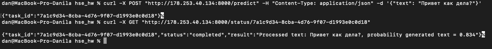
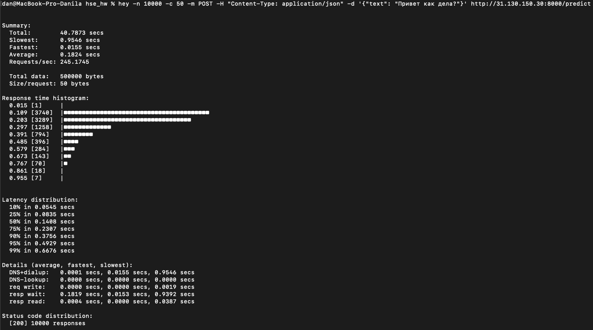

<h1 align="center">Курс "Распределенные системы"</h1>

<h2 align="center">Построение сервиcа связанного с ВКР: 

"Идентификация искусственно сгенерированных текстов: разработка методов для обеспечения информационной достоверности"</h2>

Для выполнения ДЗ ниже приложена инструкция по пошаговому развертыванию сервиса на пустом Linux-сервере, в частности я арендую 2 CPU сервиса, один из которых называю GPU, так как на нем я разворачиваю сервисы, которые будут работать на будущем GPU.

По итогу развертывания сервисов будет доступно API на CPU сервере, на который можно будет отправлять текст с целью оценки вероятности того, что он был сгенерирован AI моделью. Сервис логирует запрос пользователя в БД (PSQL), отправляет его на GPU при помощи RABBITMQ, возвращает клиенту идентификатор задачи. GPU сервер обрабатывает запрос и обновляет лог в БД, записывая результат. Клиент по полученному идентификатору может получить результат выполнения запроса.

**/predict** - Ручка сервиса CPU, на которую отправляется текст для обработки. В ответ отдается task_id, который так же логируетя в БД и отправляется на GPU сервер.

**/status/task_id** - Ручка, которая возвращает результат отработки модели по task_id, результат вытягивается из БД.

На данный момент вместо модели оценки вероятности сгенерирован ли текст стоит затычка в виде np.random.rand() на GPU сервере, модель будеьт добавлена в результате работы над дипломной работой.

В директориях CPU и GPU серверов находится инструкция по развертыванию сервисов. Ниже инструкция по нстройке серверов.

* 1) Создаем пользователя
* 2) Настройка сервера для разработки (Miniconda, Poetry, Docker, ect)
* 3) Настройка окружения для работы сервисов
* 4) Поднимаем сервисы (ссылка на инструкции)
* 5) Запрос к сервису

<h3 align="center">1. Создаем пользователя и даём права sudo  [CPU & GPU]</h3>

<h5 align="left">Для CPU & GPU сервера</h5>

<code>adduser admin</code>

<code>usermod -aG sudo admin</code>

<code>su -- admin</code>

<h3 align="center">2. Настройка сервера для разработки (Miniconda, Poetry, Docker, ect) [CPU & GPU]</h3>

<b>2.1 Устанавливаем Git, net-tools, PSQL</b>

<code>sudo apt update && sudo apt install git && sudo apt install postgresql-client -y && sudo apt install net-tools</code>

<b>2.2 Копируем репозиторий с проектом</b>

<code>git clone -b checkpoint_5 https://github.com/Dangennadevich/High-load-system.git </code>

<code>mv High-load-system/* .</code>

<b>2.3 Скачиваем Miniconda в корень (~/), Запускаем установку</b>

<code>wget https://repo.anaconda.com/miniconda/Miniconda3-latest-Linux-x86_64.sh</code>

<code>bash Miniconda3-latest-Linux-x86_64.sh</code>

<b>2.4 Добавляем переменную окружения </b>

<code>nano ~/.bashrc</code>

<code>PATH="$HOME/miniconda3/bin:$PATH" </code>

<b>2.5 Применим изменения в оболочке </b>

<code>source ~/.bashrc </code>

<b>2.6 Проверим python и conda  </b>

<code>which python</code>
<code>conda --version</code>

<b>2.7 Установим poetry для управления зависимостями и проверим установку  </b>

<code>sudo apt update  && sudo apt install python3-poetry</code>

<code>poetry config virtualenvs.create false</code>

<code>poetry --version</code>

<b>2.8 Создадим и виртуальное окружение без библиотек  </b>

<code>conda create --no-default-packages -n train_env python=3.11</code>

<code>conda activate train_env</code>

<b>2.9 [train_env] Установим Docker  </b>

<a href="https://docs.docker.com/engine/install/ubuntu/" target="_blank">docs.docker.com</a>  

<code>sudo groupadd docker</code>

<code>sudo usermod -aG docker $USER</code>

<code>newgrp docker</code>

<b>2.10 [train_env]  Настроим DNS-серверы для всех контейнеров, добавить в файл </b>

<code>sudo nano /etc/docker/daemon.json</code>

<code>{
  "dns": ["8.8.8.8", "8.8.4.4"]
}</code>

<b>2.11 [train_env]  Перезапустите Docker-демон  </b>

<code> sudo systemctl restart docker </code>

<b>2.12 [train_env]  Проверим установку docker </b>

<code> docker run hello-world </code>

<b>2.13 [train_env]  Установи Minikube  </b>

<code> curl -LO https://storage.googleapis.com/minikube/releases/latest/minikube-linux-amd64 </code>

<code> sudo install minikube-linux-amd64 /usr/local/bin/minikube </code>

<code> minikube start --driver=docker </code>

<b>2.14 [train_env]  Установи Minikube  </b>

<code> curl -LO "https://dl.k8s.io/release/$(curl -L -s https://dl.k8s.io/release/stable.txt)/bin/linux/amd64/kubectl" </code>

<code> sudo install -o root -g root -m 0755 kubectl /usr/local/bin/kubectl </code>

<h3 align="center">3. Общая настройка окружения для работы сервера  [CPU & GPU]</h3>

<h5 align="left">Для CPU & GPU сервера</h5>

<b>3.1 [train_env] Команды ниже выполняем из директории cpu_server или gpu_server для CPU и GPU сервера соответсвенно </b>

<code>cd *pu_server/ </code> 

<b>3.3 [train_env] Выполнем инициализацию poetry, устанавливаем библиотеки</b>

<code>poetry install --no-root </code> 

<b>3.4 [train_env]  Создаем файл .env с кредами </b>

<code>nano ~/*pu_server/.env</code>

<code>AWS_SECRET_ACCESS_KEY = 
AWS_ACCESS_KEY_ID = 
POSTGRES_PASSWORD =
RABBITMQ_DEFAULT_USER =
RABBITMQ_DEFAULT_PASS =
CPU_SERVER_IP=
</code> 

<h3 align="center">4. Поднимаем сервисы  [CPU | GPU]</h3>

<b>4.1 Инструкция для CPU сервера находится в ~/cpu_server/README.MD </b>

<b>4.2 Инструкция для GPU сервера находится в ~/gpu_server/README.MD </b>

<h3 align="center">5. Запрос к сервису (IP CPU сервера) [CPU]</h3>

<b>Отправляем запрос на сервис. Ожидается ответ.</b>

Ожидается ответ в виде числа, которое может быть оценкой вероятности того, что текст был сгенерирован моделью

<code>curl -X POST "http://IP_CPU_SERVER:8000/predict" -H "Content-Type: application/json" -d '{"text": "Привет как дела?"}'</code> 

Ответ: {
  "task_id":"7a1c9d34-8cba-4d76-9f07-d1993e0c0d18"
  }

<code>curl -X GET "http://IP_CPU_SERVER:8000/status/7a1c9d34-8cba-4d76-9f07-d1993e0c0d18"</code> 

Ответ: {
  "task_id":"7a1c9d34-8cba-4d76-9f07-d1993e0c0d18",
  "status":"completed",
  "result":"Processed text: Привет как дела?, probability generated text = 0.834"
  }

<h3 align="center">6. Тест нагрузки</h3>

В примере сервис поднят при помощи minicube на одном узле cpu.

