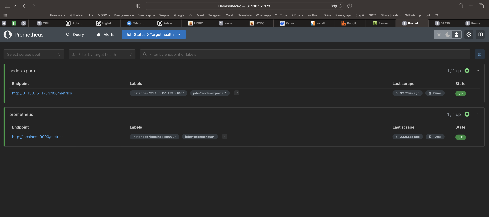
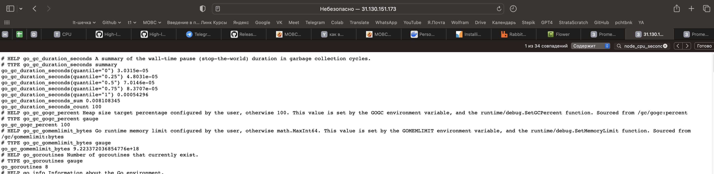
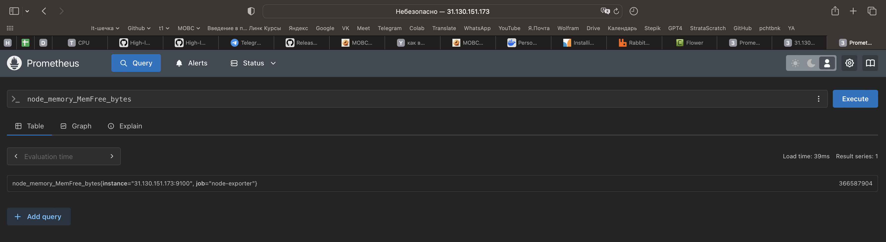
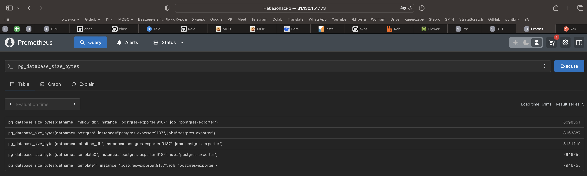

<h1 align="center">Проект по распознованию сгенерированного AI моделью текста</h1>

Проект по распознованию AI-сгенерированного текста, основные компоненты:

    * CPU сервер с FastAPI сервером, на котором будет происходить взаимодействие с пользователем.

    * GPU сервер с AI моделью, которая проводит скоринг по запросу с CPU сервера.

<h1 align="center">СPU часть проекта</h1>

При помощи Minikube поднимаем FastAPI сервис на первом сервере архитектуры. Так же в текущей версии проекта через Minicube поднимаеся вся необходимая архитектура для работы сервиса: PostgreSQL, RabbitMQ, Celery, Flower. На втором сервере поднимаем сервис, где будет работать модель.

**/predict** Ручка получает сообщение от пользователя. После получения обрабатывает его - отправляет запрос на GPU через брокера сообщений rabbitmq. Так же сервис записывает уникальный номер запроса в БД и устанавливает статус "Pending".

CPU_FASTAPI_SERV >> [Celery (RabbitMQ), PSQL DB]

**/status/{task_id}** По task_id из /predict вытаскиваем статус запроса из БД, результат работы AI модели с GPU сервера.

CPU_FASTAPI_SERV >> PSQL DB >> CPU_FASTAPI_SERV

<h1 align="center">Настройка сервисов на СPU</h1>

Выполняется после развертывания необходимого ПО на сервере (~/README.MD, пункт 1-3)

<h3 align="center">1. Поднимаем сервисы в директории cpu_server </h3>

<b>1.1 Создаем секреты </b>

<code>kubectl create secret generic app-secrets --from-env-file=.env -n default</code>

<h3 align="left">1.2 Postgres </h3>

<b>1.2.1 Применяем манифесты </b>

<code>kubectl apply -f k8s/postgres-configmap.yaml</code>

<code>kubectl apply -f k8s/postgres-pvc.yaml</code>

<code>kubectl apply -f k8s/postgres-deployment.yaml</code>

<code>kubectl apply -f k8s/postgres-service.yaml</code>

<b>1.2.2 Проверка pods</b>

<code>kubectl get pods -l app=postgres</code>

<b>1.2.3 Прокидываем порты (GPU сервер должен иметь доступ к БД для обновления логов (вносит результат)) </b>

<code>kubectl port-forward --address 0.0.0.0 service/postgres 5432:5432 > /dev/null 2>&1 &</code>

<b>1.2.4 Проверка поднятых БД</b>

<code>kubectl exec -it deployment/postgres -- psql -U postgres -d mlflow_db -c "\l"</code>

<h3 align="left">1.3 RabbitMQ </h3>

<b>1.3.1 Применяем манифесты </b>

<code>kubectl apply -f k8s/rabbitmq-deployment.yaml</code>

<code>kubectl apply -f k8s/rabbitmq-service.yaml</code>

<b>1.3.2 Проверка pods </b>

<code>kubectl get pods -l app=rabbitmq</code>

<b>1.3.3 Прокидываем порты (Брокер нужен для общение с внешним GPU сервером) </b>

<code>kubectl port-forward --address 0.0.0.0 service/rabbitmq 15672:15672 > /dev/null 2>&1 &</code>

<code>kubectl port-forward --address 0.0.0.0 service/rabbitmq 5672:5672 > /dev/null 2>&1 &</code>

<b>1.3.4 Проверяем UI и создаем очередь direct с именем direct_exchange</b>

<code>http://<IP_CPU_SERVER>:15672/#/exchanges</code>

<h3 align="left">1.4 fastapi-service</h3>

<b>1.4.1 Создаем контейнер на основе Dockerfile </b>

<code>eval $(minikube docker-env)</code>

<code>docker build -t fastapi-app:latest .</code>

<b>1.4.2 Применяем манифесты </b>

<code>kubectl apply -f k8s/fastapi-deployment.yaml</code>

<code>kubectl apply -f k8s/fastapi-service.yaml</code>

<b>1.4.3 Проверка pods </b>

<code>kubectl get pods -l app=fastapi-app</code>

<b>1.4.4 Прокидываем порты </b>

<code>kubectl port-forward --address 0.0.0.0 service/fastapi-app 8000:8000 > /dev/null 2>&1 &</code>

<b>1.4.5 Проверка сервиса </b>

<code>curl -v http://localhost:8000</code>

<code>curl -X POST "http://localhost:8000/predict" -H "Content-Type: application/json" -d '{"text": "Привет, как дела?"}'</code>

<h3 align="left">1.5 Flower </h3>

<b>1.5.1 Применяем манифесты </b>

<code>kubectl apply -f k8s/flower-deployment.yaml</code>

<code>kubectl apply -f k8s/flower-service.yaml</code>

<b>1.5.2 Проверка pods </b>

<code>kubectl get pods -l app=flower</code>

<b>1.5.3 Прокидываем порты (Брокер нужен для общение с внешним GPU сервером) </b>

<code>kubectl port-forward --address 0.0.0.0 service/flower 5555:5555 > /dev/null 2>&1 &</code>

<b>1.5.4 Проверяем UI и создаем очередь direct с именем direct_exchange</b>

<code>http://<IP_CPU_SERVER>:5555</code>

<h3 align="center">2. Проверяем работу сервисов (после поднятия сервисов на GPU) </h3>

<h3 align="left">2.1 Сервис оценки текста - написан ли он при помощи AI </h3>

<b>2.1.1 Пример запроса сгенерирован ли текст "Привет как дела?" моделью. Отправляется по адресу IP_CPU_SERVER:8000/predict :</b>

<code>curl -X POST "http://IP_CPU_SERVER:8000/predict" -H "Content-Type: application/json" -d '{"text": "Привет как дела?"}'</code> 

<b>2.1.2 Ожидаем ответ от сервиса - сгенерированный task id, пример ответа:</b>

<code>{"task_id":"64268f77-73d8-4491-b441-4d790b3ccc34"}</code> 

<b>2.1.3 Отправляем запрос с task id для получении ответа от сервера: </b>

<code>curl -X GET "http://IP_CPU_SERVER:8000/status/bdf1fdec-8985-415e-be24-e709216f9257"</code> 

<b>2.1.4 Пример ответа о запросе:</b>

<code>{"task_id":"bdf1fdec-8985-415e-be24-e709216f9257","status":"completed","result":"Processed text: Привет как дела?, probability generated text = 0.527"}</code> 

<b>2.1.5 Если работает только на localhost.. Возможно закрыт порт - откроем его</b>

<code>sudo ufw allow 8000/tcp</code> 

<code>sudo ufw reload</code> 

<h3 align="center">3. Настроим Node Exporter </h3>

<b>3.1 Установка Node Exporter</b>

<code>wget https://github.com/prometheus/node_exporter/releases/download/v1.9.0/node_exporter-1.9.0.linux-amd64.tar.gz</code> 

<b>3.2 Распакуем архив</b>

<code>tar xvf node_exporter-*.tar.gz</code> 

<code>cd node_exporter-*/</code> 

<b>3.3 Установим Node Exporter как сервис на Ubuntu</b>

<code>sudo nano /etc/systemd/system/node-exporter.service</code> 

<code>[Unit]

Description=Node Exporter

After=network.target

[Service]

User=root

ExecStart=/home/admin/cpu_server/node_exporter-1.9.0.linux-amd64/node_exporter

[Install]

WantedBy=multi-user.target</code> 

<b>3.4 Активируем и првоерим сервис:</b>

<code>sudo systemctl daemon-reload</code> 

<code>sudo systemctl start node-exporter</code> 

<code>sudo systemctl enable node-exporter</code> 

<code>sudo systemctl status node-exporter</code> 

<h3 align="center">4. Настроим Node Exporter </h3>

<b>4.1 Установим helm</b>

<code>sudo snap install helm --classic</code> 

<b>4.2 Установим Prometheus</b>

<code>helm repo add prometheus-community https://prometheus-community.github.io/helm-charts</code> 

<code>helm install prometheus prometheus-community/prometheus</code> 

<b>4.3 Настроим конфиг в Prometheus - нужно актулизировать IP хост машины</b>

<code>kubectl edit configmap prometheus-server</code> 

<b>4.4 Применим новый конфиг, а так же postgres-exporter и перезапустим prometheus</b>

<code> kubectl apply -f postgres-exporter-config.yaml</code> 

<code> kubectl apply -f postgres-exporter-deployment.yaml</code> 

<code>kubectl apply -f prometheus-config.yaml</code> 

<code>kubectl rollout restart deployment prometheus-server</code> 

<b>4.5 Проверим configmap</b>

<code>kubectl get configmap prometheus-server -o yaml | grep -A 20 "prometheus.yml:"</code> 

<b>4.6 Пробросим порт</b>

<code>kubectl port-forward service/prometheus-server 9090:80 --address 0.0.0.0</code> 

<b>4.7 Проверка, 31.130.151.173 - внешний IP арендованной машины</b>

<code>http://31.130.151.173:9090/targets</code> 

<code>http://31.130.151.173:9100/metrics</code> 

<code>http://31.130.151.173:9090/graph</code> 

<b>4.8 Пример метрик Postgres SQL</b>

<b>4.9 Запрос метрик через Prometheus</b>

<code>http://31.130.151.173:9090/graph</code> 

<code>node_cpu_seconds_total</code> 

<code>node_memory_MemFree_bytes</code> 

